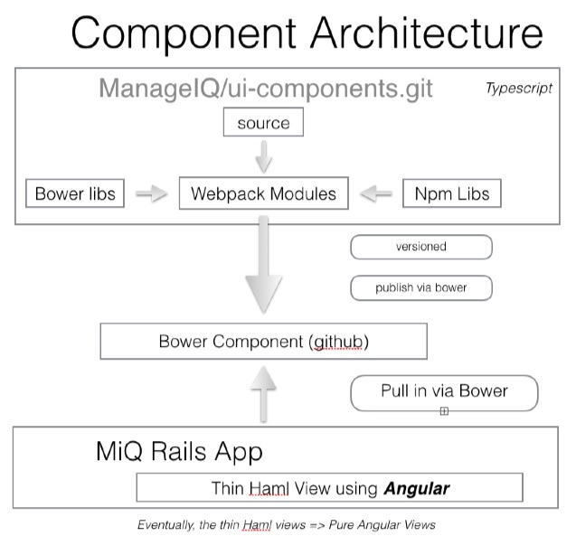

= Angular UI Components for ManageIQ

image::https://www.bithound.io/github/ManageIQ/ui-components/badges/score.svg[link="https://www.bithound
.io/github/ManageIQ/ui-components"]
image::https://www.bithound.io/github/ManageIQ/ui-components/badges/dependencies.svg[link="https://www.bithound
.io/github/ManageIQ/ui-components/master/dependencies/npm"]

ifdef::env-github[]
[link=https://travis-ci.org/ManageIQ/ui-components
image:https://travis-ci.org/ManageIQ/ui-components.svg["Build Status",
link="https://travis-ci.org/ManageIQ/ui-components"]
endif::[]

== Architectural Goals

* Separate git repository from ManageIQ
* Components communicate via REST with ManageIQ API
* Maintain routing inside ManageIQ(routes.rb)

== Architecture

== Angular 1.5 Components

We are recommending https://docs.angularjs.org/guide/component[Angular 1.5 Components] instead of Angular Directives
for better compatibility and easier upgrade to Angular 2.0.

For a great overview of using Angular 1.5.x Components please see:
https://www.youtube.com/watch?list=PLOETEcp3DkCq788xapkP_OU-78jhTf68j&v=AMwjDibFxno&ab_channel=ng-conf[NG-Conf 2016:
Components, Components, Components!...and Angular 1.5 - Pete Bacon Darwin]

== Development Environment

You need to have installed https://docs.npmjs.com/getting-started/installing-node[Node.js >= 5 and npm >= 3] on
your system.

Install these node packages globally in the system
[source]
npm install -g typings bower webpack wiredep-cli typescript typescript-formatter

Install local node dependencies
[source]
npm install

To run:
[source]
npm start

Before submitting code, run the following command to format the code according to the tslint rules:
[source]
tsmft -r

This formats the code according to the tslint rules.

